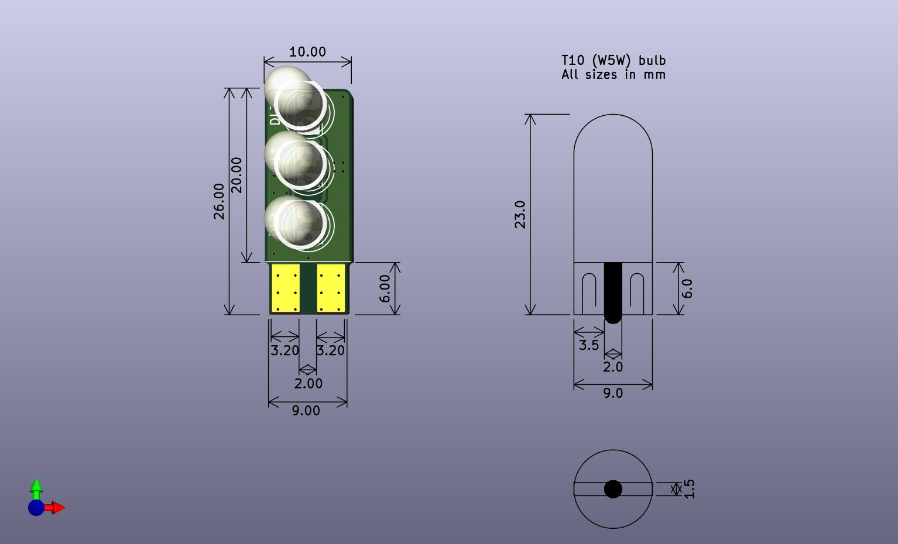
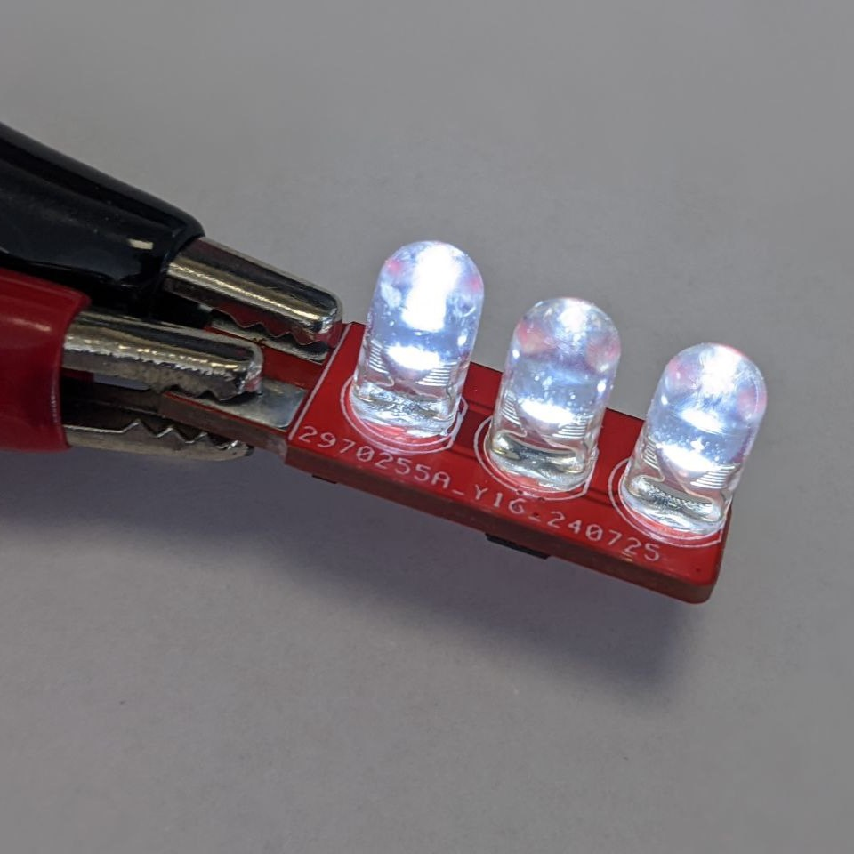
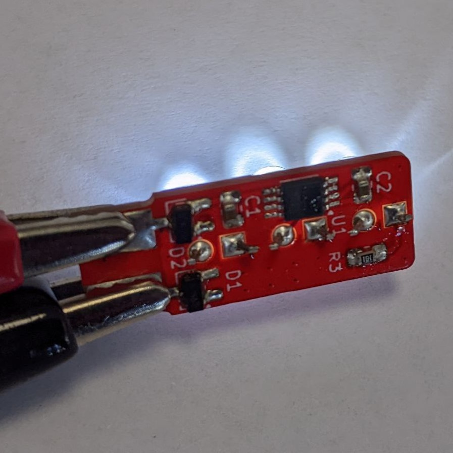

# T10-W5W-LED-Replacement

KiCad design for a T10 (W5W) 12V bulb replacement using LEDs, reducing power consumption and providing a longer lifespan compared to traditional filament bulbs.

## Overview

The goal is to create a more energy-efficient, long-lasting LED alternative to traditional filament bulbs commonly used in automotive applications.

The LEDs are driven by the LT1962 voltage regulator, acting as a constant current source for stable LED operation.
The LT1962 is a low-dropout (LDO) linear voltage regulator with the following key features that make it particularly suitable for this application:
- **Low Dropout Voltage:** The LT1962 has an exceptionally low dropout voltage (typically 270mV at 300mA), making it ideal for automotive environments where the input voltage can fluctuate.
- **High Input Voltage Range:** With an input voltage range of up to 20V, the LT1962 can easily handle the variations in automotive electrical systems, which typically range (roughly) from 11 to 14V
- **Thermal Protection:** Built-in thermal shutdown protects the regulator and the LED circuit from overheating, enhancing the overall reliability.

A series resistor (R3 in the schematic) is used to set the current flowing through the LEDs in conjunction with the LT1962 voltage regulator.
The LT1962 regulates the voltage to a specific reference value (1.22V for the adjustable version, or fixed values such as 1.5V, 1.8V, etc., depending on the version used).

The value of the series resistor $R_3$ can be calculated using the following formula:

$$
R_3 = \frac{V_{ref}}{I_{LED}}
$$

Where:
- $V_{ref}$ is the reference voltage of the LT1962 (e.g., 1.22V for the adjustable version).
- $I_{LED}$ is the desired current through the LED.

It's important to ensure that the total voltage drop across the LED and the resistor remains below 12V to maintain constant current operation. If the LED's forward voltage is too high, or if the input voltage is too low, the LT1962 might not regulate properly, leading to variations in the LED current.

### Example Calculation

If you are using the adjustable version of the LT1962 with a reference voltage $V_{ref}$ of 1.22V and you want to set the LED current $I_{LED}$ to 20mA, the resistor value would be:

$$
R_3 = \frac{1.22V}{0.02A} = 61 \Omega
$$

Rounded to the nearest standard value, you would use a **62Ω** resistor to achieve approximately a 19.7mA current through the LED.

## Contributions

Contributions are welcome! Feel free to fork this repository and submit a pull request with your improvements.
